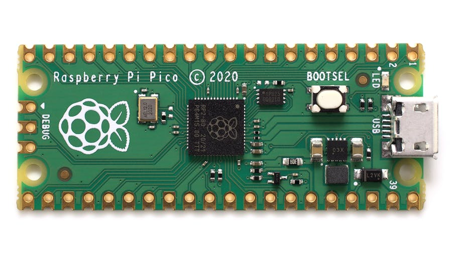

# Web Server written in micropython for a Raspberry Pi Pico W


[](https://svgshare.com/i/Zhy.svg)
[](https://svgshare.com/i/ZjP.svg)
[](https://www.python.org/downloads/release/python-385/)
[](https://github.com/Naereen/badges/)
[](https://www.python.org/)

[](https://www.vim.org/)
[](https://code.visualstudio.com/)

[](https://lbesson.mit-license.org/)
[](http://perso.crans.org/besson/LICENSE.html)

Web Server written in micropython for a Raspberry Pi Pico W 2 - Wifi - BT

By Engineer: Felipe A. Gonzalez <f.alfonso@res-ear.ch>

If you like my project, give it a :star: or support me by buying me a coffee :coffee::grinning:

<a href="https://www.buymeacoffee.com/felipealfonsog" target="_blank"></a>


### Important Notice
<blockquote class="twitter-tweet" data-lang="en"><p lang="en" dir="ltr">Starting February 9, we will no longer support free access to the Twitter API, both v2 and v1.1. A paid basic tier will be available instead 🧵</p>&mdash; Twitter Dev (<a href="https://twitter.com/TwitterDev/status/1621026986784337922?ref_src=twsrc%5Etfw">@TwitterDev</a>) February 2, 2023</blockquote>

---

### Table of Contents

- [Getting Started](#getting-started)
  - [Prerequisites](#prerequisites)
    - [To Run it](#to-run)
    - [To Host](#to-host)
- [Instructions](#instructions)
  - [File Structure](#file-structure)
- [Deployment](#deployment)
- [Contributing](#contributing)
- [Creator / Maintainer](#creator--maintainer)
- [Additional Information](#additional-information)

---

## Getting Started

Get a raspberry pi pico w 2 - wifi. Get a project usb - micro-c cable and get thonny.



### Prerequisites

#### To Run it

- [Python 3](https://www.python.org/downloads/)
- [Thonny](https://thonny.org) - a micropython IDE

#### To Host

You can host it locally, or directly when it's connected via USB, but that implementation is not yet properly working fine.

It can be used to host a site 24/7. Also has a implementation for a 404 file not find, like most webservers. 

---

## Instructions

1. Get thony IDE and modify the network connectivity. 

2. Run the file setting up Thonny to run the code as a raspberry pi pico

- Make sure you have uploaded the files in the raspberry.

```

4. Adjustments you can make in `config`_

   - **search_
   - **delay** - Time 
     - Please be aware of
     - "recent", "popular", or "mixed"
   - **number_of
   - **run_continuously** - Set True if you want the bot to run continuously
     - Also set True if you will be deploying the script

5. Run the script!

```
python webserver.py
```

### File Structure

```
Web server in micro-python
 |-- webserver.py
 |-- default.html
 |-- 
 |--  
```

---

## Deployment

Here is a tutorial on how to deploy 


```

[Additional Information](#additional-information) for details on running the script continuously.
    - 

---

## Contributing

Pull requests are welcome. For major changes, please open an issue first to discuss what you would like to change. Please make sure to update tests as appropriate. But i would prefer if you could contact me first. 

### How To Contribute

1. Fork the repository to your own Github account.
2. Clone the project to your machine.
3. Create a branch locally with a succinct but descriptive name.
4. Commit changes to the branch.
5. Following any formatting and testing guidelines specific to this repo.
6. Push changes to your fork.
7. Open a Pull Request in my repository.

---

### Creator / Maintainer
Computer Science Engineer:
Felipe Alfonso González L. ([felipealfonsog](https://github.com/felipealfonsog))

If you have any questions, comments, or concerns, feel free to contact me below.

<p align="left">
  <a href="mailto:felipe.alfonso.glz03@gmail.com"> 
    
  </a>
</p>

This project was created for educational purposes of learning development, documentation, and deployment and for personal and open-source use.

Default values of the project are used to /

If you like my content or find this code useful, give it a :star: or support me by buying me a coffee :coffee::grinning:

<a href="https://www.buymeacoffee.com/felipealfonsog" target="_blank"></a>

---

## Additional Information

- [Getting Started with Thonny](https://thonny.org/)
- [How to Continuously Run a Python Script on an EC2 Server](https://intellipaat.com/community/9361/how-to-continuously-run-a-python-script-on-an-ec2-server)
