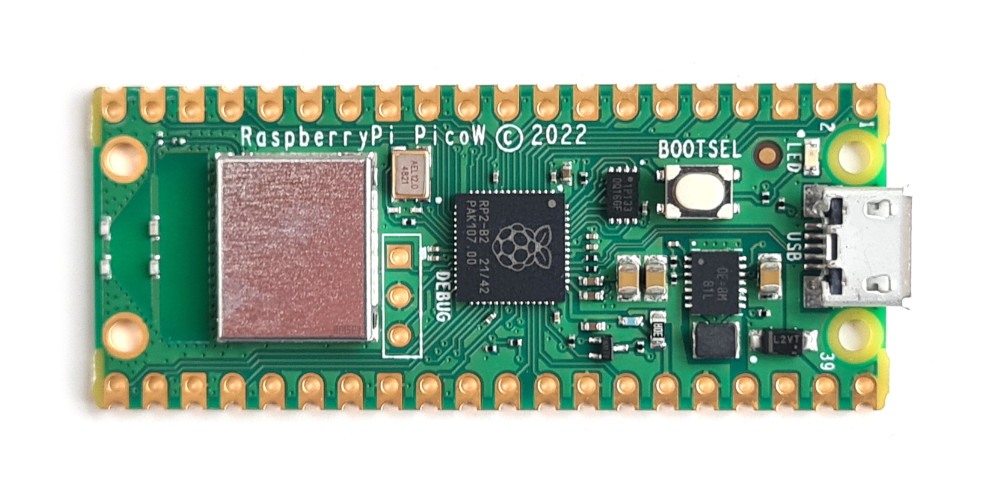

## PicoWebPy 
Web Server written in micropython for a Raspberry Pi Pico W 2 - Wifi - BT


[](https://github.com/Naereen/badges/)

[](https://lbesson.mit-license.org/)
<!--
[](http://perso.crans.org/besson/LICENSE.html)
-->

[](https://www.vim.org/)
[](https://code.visualstudio.com/)
<!-- 
### Important Notice
<blockquote class="twitter-tweet" data-lang="en"><p lang="en" dir="ltr">You can buy for about 10 or 15 USD a Raspberry Pi Pico in Aliexpress 🧵</p>&mdash; - May 28, 2023</blockquote>

---
-->
#
#### Table of Contents

- [Getting Started](#getting-started)
  - [Prerequisites](#prerequisites)
    - [To Run it](#to-run-it)
    - [To Host](#to-host)
- [Instructions](#instructions)
  - [File Structure](#file-structure)
- [Deployment](#deployment)
- [Contributing](#contributing)
- [Creator / Maintainer](#creator--maintainer)
- [Additional Information](#additional-information)


---

#### Getting Started

Get a raspberry pi pico w 2 - wifi. Get a usb - micro-c cable and get thonny IDE.



#### Prerequisites

#### To Run it

- [Python 3](https://www.python.org/downloads/)
- [Thonny](https://thonny.org) - a micropython IDE

#### To Host

You can host it locally, or directly when it's connected via USB, but that implementation is not yet properly working fine.

It can be used to host a site 24/7. Also has a implementation for a 404 file not find, like most webservers. 

---

#### Instructions

1. Get thony IDE and modify the network connectivity. 

2. Run the file setting up Thonny to run the code as a raspberry pi pico

- Make sure you have uploaded the files in the raspberry.

4. Run the script!

```
webserver.py
```

#### File Structure

```
Web server in micro-python
 |-- webserver.py
 |-- default.html 
```

---

#### Deployment

[Additional Information](#additional-information) for details on running the script continuously.
    - 

---

#### Contributing

Pull requests are welcome. For major changes, please open an issue first to discuss what you would like to change. Please make sure to update tests as appropriate. But i would prefer if you could contact me first. 

#### How To Contribute

1. Fork the repository to your own Github account.
2. Clone the project to your machine.
3. Create a branch locally with a succinct but descriptive name. You can use 'development' directly. 
4. Commit changes to the branch.
5. Following any formatting and testing guidelines specific to this repo.
6. Push changes to your fork.
7. Open a Pull Request in my repository - Before start a conversation.

-For Development, use the development branch and then we can do a pull request to the main branch. use : git --help for swtiching ... e.g.:
```
felipe@Felipes-MacBook-Air webserver-raspberry-pico % git branch development
felipe@Felipes-MacBook-Air webserver-raspberry-pico % git branch        
  development
  * main
felipe@Felipes-MacBook-Air webserver-raspberry-pico % git checkout development
```
When git push for 'development':
```
git push --set-upstream origin development
git branch --set-upstream-to=origin development

git clone -b <branchname> <remote-repo-url>
```

---

#### Creator / Maintainer
Computer Science Engineer:
Felipe Alfonso González L. ([felipealfonsog](https://github.com/felipealfonsog))

#### 🤝 Support and Contributions

If you find this project helpful and would like to support its development, there are several ways you can contribute:

- **Code Contributions**: If you're a developer, you can contribute by submitting pull requests with bug fixes, new features, or improvements. Feel free to fork the project and create your own branch to work on.
- **Bug Reports and Feedback**: If you encounter any issues or have suggestions for improvement, please open an issue on the project's GitHub repository. Your feedback is valuable in making the project better.
- **Documentation**: Improving the documentation is always appreciated. If you find any gaps or have suggestions to enhance the project's documentation, please let me know.

[](https://www.buymeacoffee.com/felipealfonsog)
[](https://www.paypal.com/felipealfonsog)
[](https://github.com/sponsors/felipealfonsog)

Your support and contributions are greatly appreciated! Thank you for your help in making this project better.

---

#### Additional Information

- [Getting Started with Thonny](https://thonny.org/)
- [How to Continuously Run a Python Script on an EC2 Server](https://intellipaat.com/community/9361/how-to-continuously-run-a-python-script-on-an-ec2-server)
